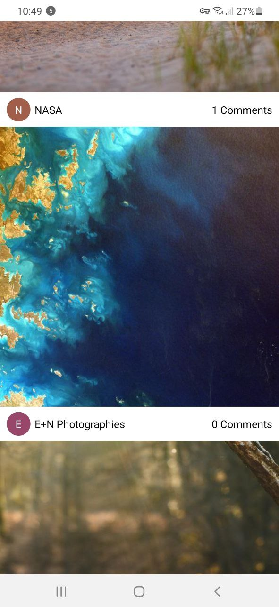
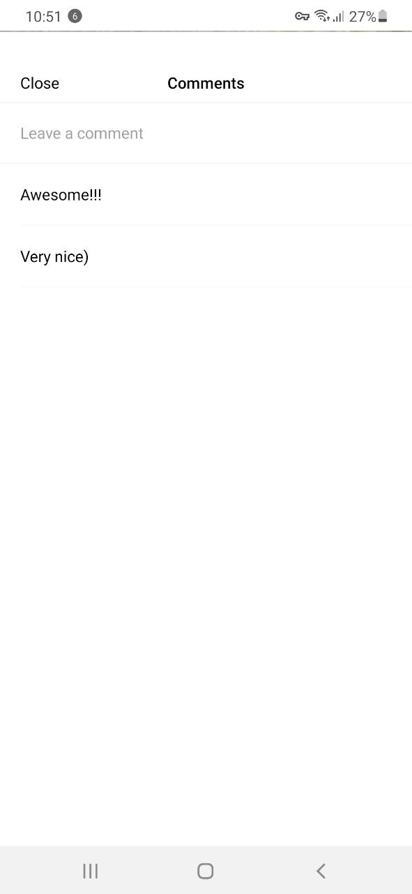

# Image Feed

## Preview

### Feed Screen

### Comments Screen

## Available Scripts

In the project directory, you can run:

### `npm start`

Runs the app in the development mode.

### `npm run android`

Runs the app on the Android emulator.

### `npm run ios`

Runs the app on the iOS simulator.

### `npm run web`

Runs the app in a browser.

### `npm test`

Launches the test runner in the interactive watch mode.

### `npm run test:final`

Launches the test runner with coverage information.
